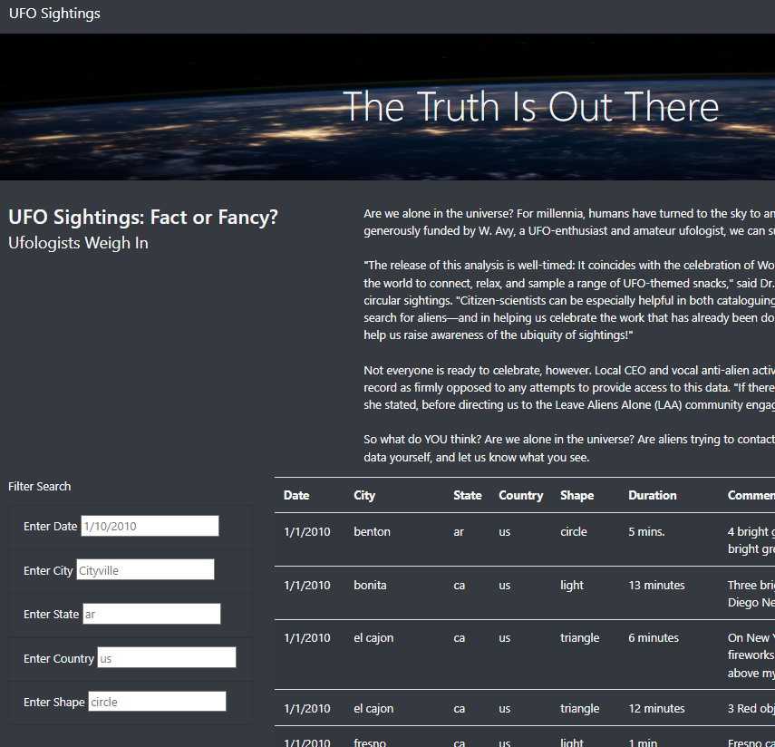
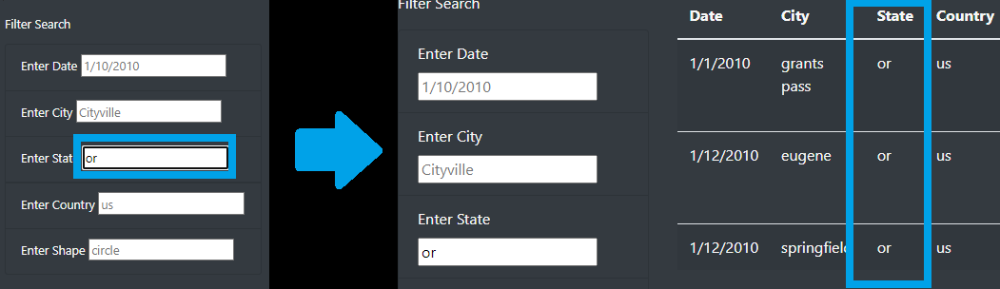

# UFOs - Module 11 - Javascript

## Overview of the Analysis

The purpose of this analysis is to create an html file that can filter UFO sighting data and act dynamically. The table will be filtered by date, city, state, country, and shape from a provided list of sightings to filter from.

## Resources Used
- Software: SQLAlchemy 1.4.27, Python 3.7.6, Visual Studio Code 1.63.2, D3.js library

## Results

The webpage can be found at https://akatter.github.io/UFOs/. An example of what the webpage looks like is shown here.

In order to filter the data on the site, the input boxes can be used to filter the data. Initially the website shows all the provided data with no filters used. Data can be inputted into the text box input field in order to filter the data as shown.

After pressing enter or navigating away from the input box by doing something like clicking elsewhere on the page, the filters will update and show the filtered data. While not shown, multiple filtering conditions can be used at one time.

## Summary

One drawback of the website if that the filters only take data that specifically matches the input, while something like states or countries can potentially be entered in different ways. As an example, California can be entered as 'ca', 'CA', or 'California'. This could potentially confuse users of the site who may type in locations they want to filter, but not match the provided data and not find the data they were looking for.

One improvement that can be made is introducing a way to make the inputs ignore case, which would solve some of the potential input issues in a lot of categories, ensuring that even when the inputted filter may not perfectly match the table, the data may still be able to be filtered.

Another improvement could be using something like dropdown menus or added tables for improved filtering. For a category like shape, a visitor to the site may not know what options were used to classify each event, so a drop down menu of the options could easily solve that option. Having data on states that can limit the data entered in the filter field can also help reduce errors.
